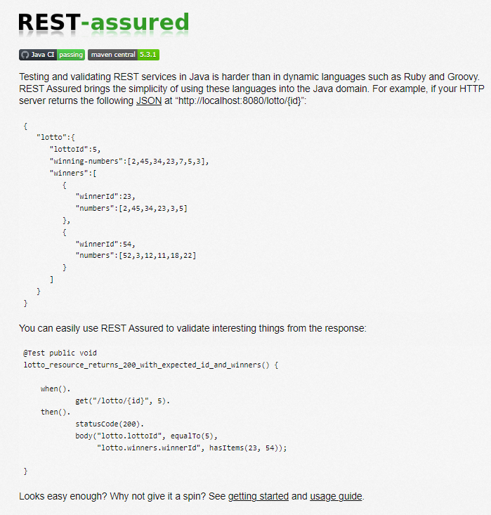

# Rest-assured with just Java (NOT A TUTORIAL)

If need an automated testing of a Rest API of a given software product, you can rest assured that Rest-assured is one option that you can use.

It is an industry standard library and there are a lot of tutorial that can help you understand on how to use them.

But, as the title said, this article is not here to teach you anything at all, it's an article where I want to show you what I have learned about Java.

Those things about Java that, in my case, something that is familiar and ever-present since I learn the language for the first time, but I haven't had a full understanding of what they actually are. Up until now.

So that's why I want to run Rest-assured with just Java so that I can test my understanding, discover the reasons of why some [Chesterton's Fence][1] is there, and show them to you in this article.

Emphasis on the word "just", because I mean it. No gradle, no maven, no IDE. We will do programming caveman-style with just notepad, terminal, and a pre-installed JDK environment. Plus maybe a browser to search stuff up or ask ChatGPT, or if you readers want to follow along, have this article open while you do it with me.

and it doesn't have to be Rest-assured actually, it can be any java library, I just choose it because I like the name :) (Cool article title, isn't it?)

# Preparing our wooden club

a group of caveman prepares to hunt a mammoth, but first, they have to check their weaponry first and ensure where the prey is located. I have briefly mentioned what we will need but I will go a little bit into the details here. So our wooden clubs are:

1. Notepad, or TextEdit, or any text editor of your choice
2. Terminal
3. a JDK environment

    I am not gonna go over how to install JDK here but your device might luckily be one of the 3 Billion devices that have Java, so you can check in your terminal with

    ```sh
    java -version
    ```
        
    if it shows the version, then you are good to go. If not, then maybe you can visit https://www.oracle.com/id/java/technologies/downloads/#java17
        
    What I'll be using is Java version 17 but I'm sure previous versions are still fine as well or at least make sure you are Java version >8. 

There are some more "software" that we were gonna need, but first I want to have a look at the mammoth that we're gonna hunt. which is located in the http://rest-assured.io homepage accessed on 13 August 2023. The example code of Rest-assured. (I have to be specific on the date so the 12th reader of this article reading this on 2123 might not be confused if the website is changed by then)



Our goal is to run that Java code.

Now that we're clear, let's move on to the remaining things we're gonna use, which are:

4. a software to access the internet

    Which you probably have used already to access that homepage, the Browsers, and `curl` that is usually already pre-installed in your terminal. We will need both because some of the steps we're gonna take are easier done in one and some others in another.

5. a software to mock API

    If you look at the Rest-assured homepage, there is one part that is not a Java program, which is a HTTP server that returns a certain JSON. Since that homepage doesn't give us anything to simulate that, we will have to mock them ourself. This is easy to achieve with the help of dedicated mocking software, and one popular options is [Mockoon][2].
    I will also not explain how to set this up because I trust you :)

    or maybe an alternative to using Mockoon is to use what I'll be using, which a software called [Babashka][3], a powerful scripting alternative, currently my favorite piece of software that I am now refraining myself to talk lengths about it, and I have wrote a mock server with it that you can use with these two commands (the first command installs Babashka, the second one runs the mock server I wrote):

    ```sh
    bash < <(curl -s https://raw.githubusercontent.com/babashka/babashka/master/install)
    bb -e '(load-string (slurp "https://gist.githubusercontent.com/keychera/75128c639bd9c21bc7e079cd00d858f6/raw/25fd1643aa226cccb9f933c682f289716516cf1c/lotto.clj"))'
    ```

    Whatever mock solution you choose, now you can curl your mock server to get the json from the Rest-assured homepage

    ```sh
    curl http://localhost:8080/lotto/5
    ```
    (note that the mock url use port 8080, following the example from the Rest-assured homepage. your mock solution might have different defaults)

# The Qualified Hunters and The Plan of Attack
    
Before we head into battle, I want to get out one prerequisite of the way before reading, I will assume that: 

1. You understand Java syntax

    I am not showing you what I learn about writing Java, not even how to read them. We will only focus only one thing: Executing java code with just java. I want that distinction to be clear in this article.

And then, the way this article structured is that I will show you the steps I take to achieve the goal, and I will present you things that I've learned along the way. 

# Tme to hunt

At this point, I feel like the hunter's metaphor might not serve the narrative well, so treat it as just an extra flavor because what we're going to do is something that I think hunter's don't do: Trial and Error

Thankfully, error in software in this case does not lead to death. so will will gung-ho everything in our first attempt. The steps in quick succession are as follow:

1. copy the whole code into a file, name that file anything with .java extension, e.g. `01.java`
2. in the terminal, run `java 01.java`

and we will get this error:
```sh
01_RestAssured.java:1: error: class, interface, enum, or record expected
@Test public void
             ^
01_RestAssured.java:11: error: class, interface, enum, or record expected
}
^
2 errors
error: compilation failed
```

By understanding the java syntax, this error is expected. The code is not a complete Java code and it's understandable, since it's a code snippet anyway and it's part of a bigger tool. So let's complete them ourself!

Every java program needs `public void main(String[] args)` to run. So we will copy the code below in a new file `02.java`

```java
class Main {
    @Test public static void lotto_resource_returns_200_with_expected_id_and_winners() {
        when().
                get("/lotto/{id}", 5).
        then().
                statusCode(200).
                body("lotto.lottoId", equalTo(5),
                    "lotto.winners.winnerId", hasItems(23, 54));

    }

    public static void main(String[] args) {
        lotto_resource_returns_200_with_expected_id_and_winners();
    }
}
```
and run `java 02.java`

and we will get
```sh
2.java:6: error: cannot find symbol
    @Test public static void lotto_resource_returns_200_with_expected_id_and_winners() {
     ^
  symbol:   class Test
  location: class Main
02.java:7: error: cannot find symbol
        when().
        ^
  symbol:   method when()
  location: class Main
02.java:11: error: cannot find symbol
                body("lotto.lottoId", equalTo(5),
                                      ^
  symbol:   method equalTo(int)
  location: class Main
02.java:12: error: cannot find symbol
                    "lotto.winners.winnerId", hasItems(23, 54));
                                              ^
  symbol:   method hasItems(int,int)
  location: class Main
4 errors
error: compilation failed
```

Now is the perfect time to tell you a lesson I've learn so far on learning Java or maybe programming in general. If I compare my junior past self to my less-junior current self, my past self would ask:

"I have never seen this error, How do I fix this?"

and my current self would say:

"Why does the error say 'cannot find symbol'? Where does that come from? Which piece of code might caused it? or maybe it is missing something?"

I remember there are a lot of times where I always try to jump finding a solution, copy pasting the error in google and use whatever stackoverflow code snippet I can stick in my code, and a lot of times, the answer were already there specified in the error message that I didn't even bother to read. I only reacted what comes up on the screen. At the time,  I didn't realize that what's important about an "error message" is not just that it is an "Error", it is also a "Message". It is an asynchronous communication between you and the engineer who build the software you use. 

Since some software are not equally good in communication as one another, the only thing that we can control is that we need to become a good listener. Moving forward in this article, I want this to be burned in your mind that you need to:

> Always read the error message

and we will do just that


[1]: https://sproutsschools.com/chesterton-fence-dont-destroy-what-you-dont-understand/#:~:text=Chesterton's%20Fence%20is%20a%20simple,created%20in%20the%20first%20place.
[2]: https://mockoon.com/
[3]: https://babashka.org/
